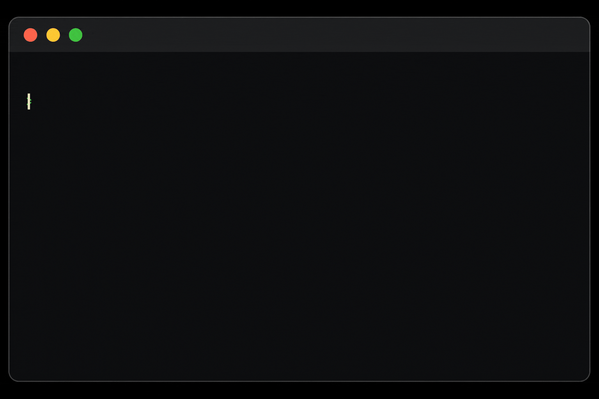

  

<!-- TYPING ANIMATIONS -->

  

<!-- PROFILE BANNER -->

  

  

<!-- GITHUB TROPHIES SECTION -->
<h3 align="left">
  
  <b>GitHub Trophies</b>
</h3>

  

  

<!-- ABOUT ME SECTION -->

<h3 align="left">
  
  <b>About Me</b>

  

  

<!-- CONNECT WITH ME SECTION -->

<h3 align="left">
  
  <b>Connect With Me</b>
</h3>

  &nbsp;&nbsp;
  &nbsp;&nbsp;
  &nbsp;&nbsp;
  

  

<!-- TECH STACK SECTION -->

<h3 align="left">
  
  <b>Tech Stack & Tools</b>
</h3>

  
     
  

  

<!-- GITHUB STATS SECTION -->

<h3 align="left">
  
  <b>GitHub Stats</b>
</h3>

  
  

  

<!-- GITHUB STREAK SECTION -->
<h3 align="left">
  
  <b>GitHub Streak</b>
</h3>

  

  

<!-- RANDOM DEV QUOTE -->
<h3 align="left">
  
  <b>Dev Quote</b>
</h3>

  

  

<!--FOOTER BANNER -->

  

